# 🛡️ Cybersecurity Home Lab - Network Setup & Nmap Scanning

> *A hands-on virtual environment for practicing offensive and defensive security techniques.*

---

## 📋 Table of Contents

- [Objective](#-objective)
- [Lab Environment](#-lab-environment)
- [Network Configuration](#-network-configuration)
- [Lab Steps](#-lab-steps)
  - [1. Lab Setup](#1️⃣-lab-setup)
  - [2. Network Configuration](#2️⃣-network-configuration)
  - [3. IP Configuration](#3️⃣-ip-configuration)
  - [4. Connectivity Testing](#4️⃣-connectivity-testing)
  - [5. Network Scanning](#5️⃣-network-scanning)
  - [6. Service Detection](#6️⃣-service-detection)
  - [7. Web Server Setup](#7️⃣-web-server-setup-apache)
  - [8. Web Technology Detection](#8️⃣-web-technology-detection)
- [Troubleshooting](#️-errors--troubleshooting)
- [Results & Key Learnings](#-results)
- [Conclusion](#-conclusion)

---

## 🎯 Objective

Build a virtual cybersecurity environment using **Kali Linux**, **Ubuntu**, and **Windows 11**, configure network connectivity between virtual machines, and perform network reconnaissance using **Nmap** to identify active hosts and running services.

---

## 🧱 Lab Environment

### 💻 Virtualization Platform
| Tool | Details |
|------|---------|
| Hypervisor | VMware Fusion |

### 🖥️ Virtual Machines

| Role | OS | Purpose |
|------|----|---------|
| 🔴 Attacker | Kali Linux | Offensive tools, scanning, reconnaissance |
| 🟢 Server | Ubuntu | Target — Apache web server |
| 🔵 Client | Windows 11 | Target — RPC/SMB services |

---

## 🌐 Network Configuration

| Setting | Value |
|---------|-------|
| Network Type | Host-only |
| Subnet | `192.168.248.0/24` |

### 📡 IP Address Assignments

| Machine | IP Address |
|---------|-----------|
| 🔴 Kali Linux | `192.168.248.130` |
| 🟢 Ubuntu | `192.168.248.128` |
| 🔵 Windows 11 | `192.168.248.129` |

---

## ⚙️ Lab Steps

---

### 1️⃣ Lab Setup

Initial setup of all three virtual machines in VMware Fusion with appropriate OS configurations.

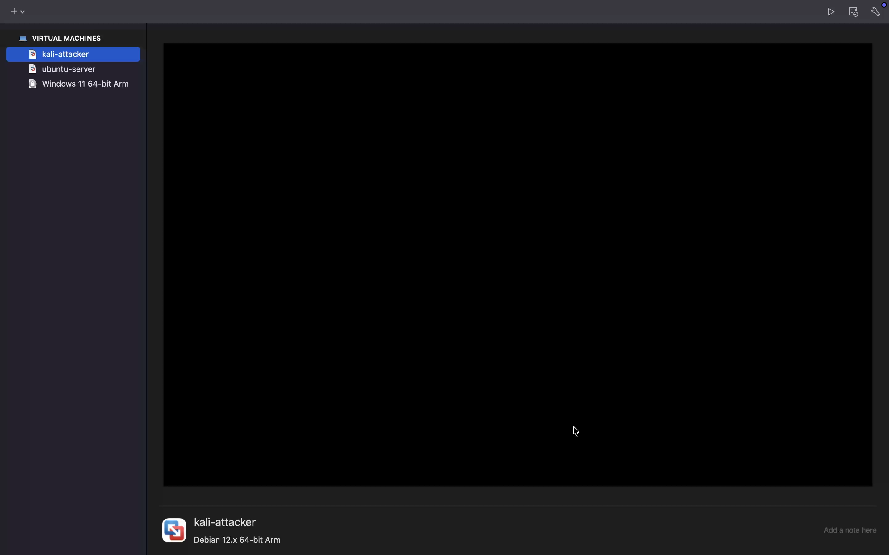

---

### 2️⃣ Network Configuration

Configured Host-only networking to allow inter-VM communication while keeping the lab isolated from external networks.

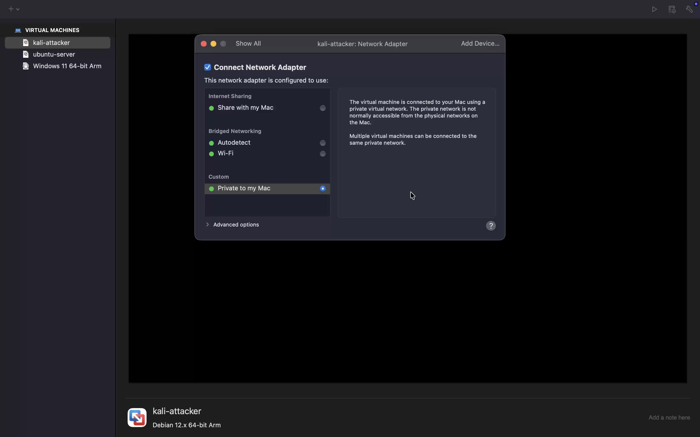

---

### 3️⃣ IP Configuration

Static IP addresses were assigned to each machine to ensure consistent addressing throughout the lab.

#### 🔴 Kali Linux
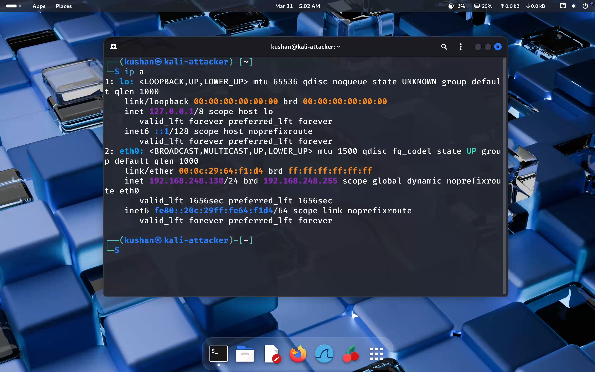

#### 🟢 Ubuntu
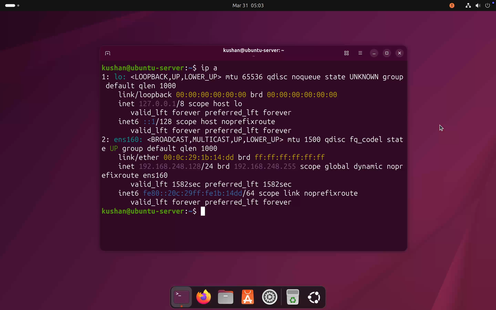

#### 🔵 Windows 11
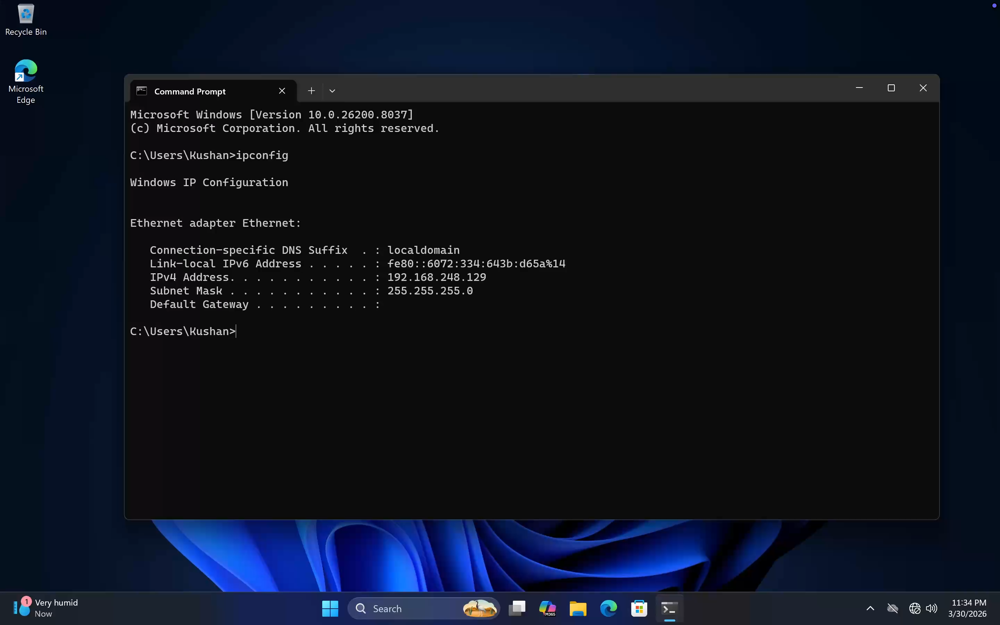

---

### 4️⃣ Connectivity Testing

Verified network connectivity between machines using `ping` before proceeding with scanning.

#### Ping → Ubuntu


#### Ping → Windows
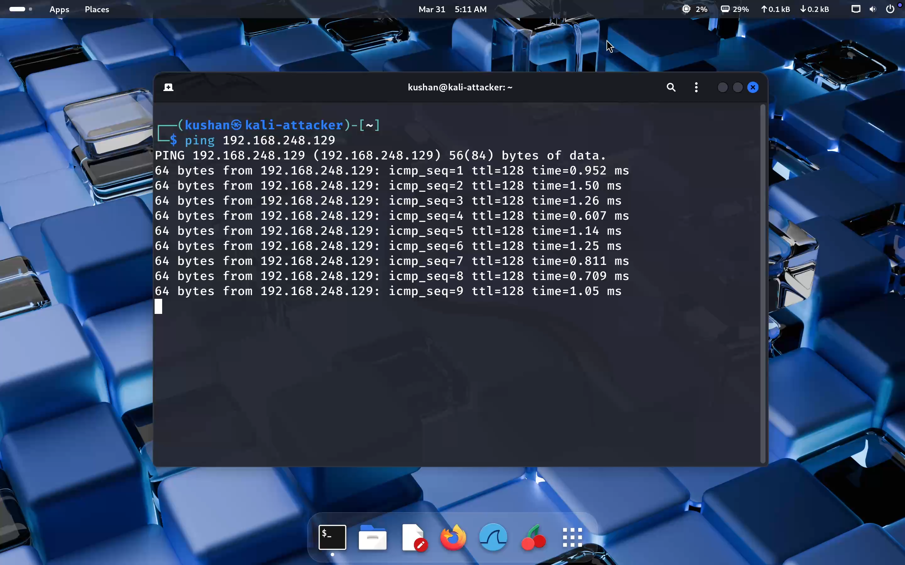

---

### 5️⃣ Network Scanning

Performed a full subnet scan using Nmap to discover all active hosts on the network.

```bash
nmap 192.168.248.0/24
```

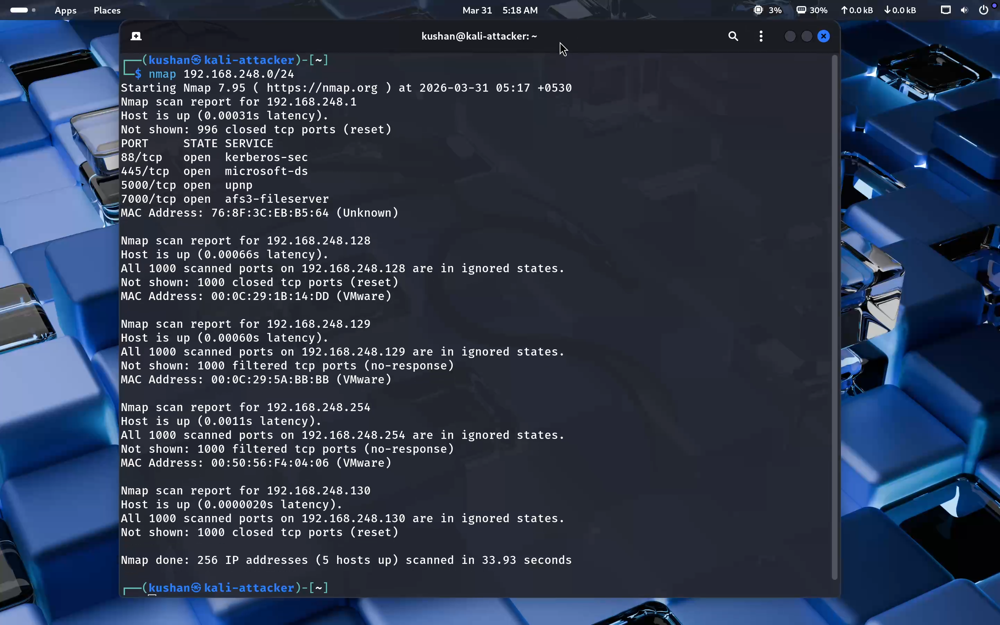

---

### 6️⃣ Service Detection

Used Nmap's version detection flag to enumerate running services and their versions on discovered hosts.

```bash
nmap -sV 192.168.248.0/24
```

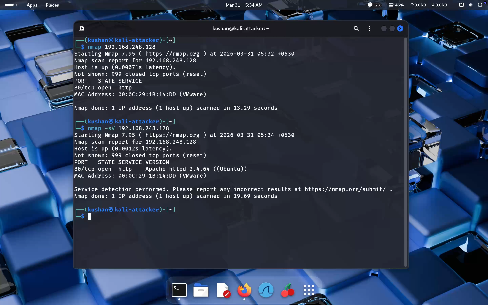

#### 🔍 Identified Services

| Machine | Port | Protocol | Service |
|---------|------|----------|---------|
| 🟢 Ubuntu | `80` | TCP | HTTP — Apache Web Server |
| 🔵 Windows | `135` | TCP | RPC (Remote Procedure Call) |
| 🔵 Windows | `445` | TCP | SMB (Server Message Block) |

---

### 7️⃣ Web Server Setup (Apache)

An Apache web server was installed on the Ubuntu machine to simulate a real-world HTTP service, making it a realistic target for reconnaissance.

#### Installation

```bash
sudo apt update
sudo apt install apache2 -y
```

After installation, the Apache service was started and verified locally on Ubuntu.

#### 🌐 Accessing Apache from Kali Linux

To simulate an attacker accessing a live web service, the Apache server was accessed directly from the Kali machine via browser:

```
http://192.168.248.128
```

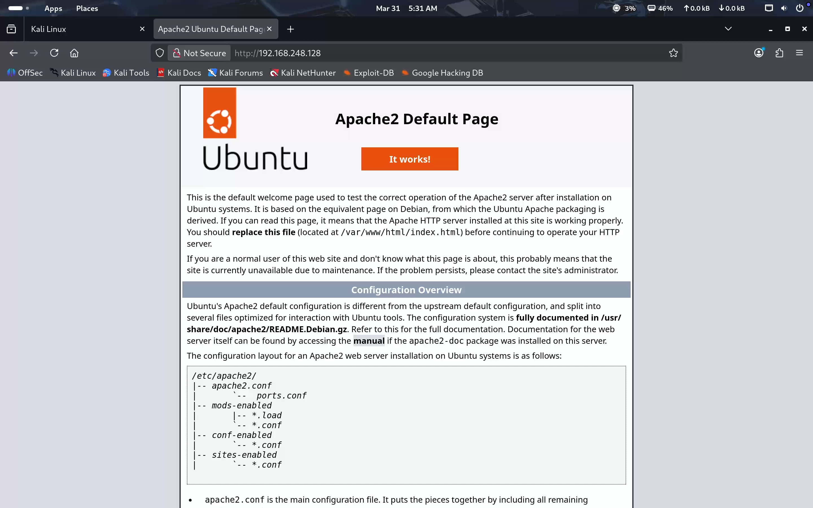

---

### 8️⃣ Web Technology Detection

`WhatWeb` was used to fingerprint the technologies running on the target web server — a common step in real-world web application reconnaissance.

```bash
whatweb http://192.168.248.128
```

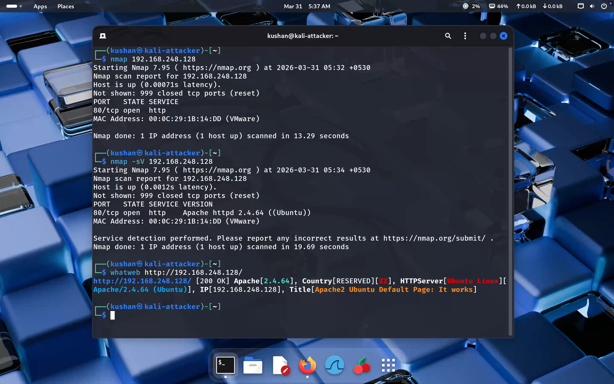

---

## ⚠️ Errors & 🛠️ Troubleshooting

During the lab, several issues were encountered and resolved:

| Issue | Resolution |
|-------|-----------|
| Network connectivity failures | Verified adapter type (Host-only vs NAT) |
| Misconfigured IP addresses | Rechecked and corrected IP settings on each VM |
| Service detection delays | Restarted services; re-ran Nmap scans |
| Apache not starting | Checked service logs; resolved dependency issues |

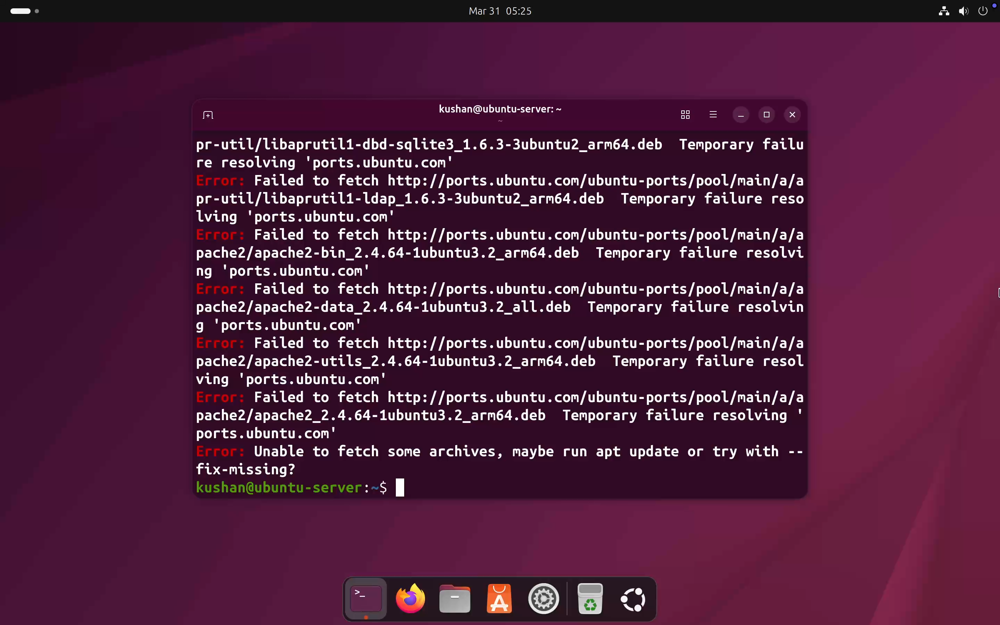

> 💡 **Takeaway:** Troubleshooting connectivity and service issues is a core skill in both IT operations and cybersecurity — this lab provided realistic practice in both.

---

### 🌐 Network Adapter Configuration

Two adapter types were used in combination to balance isolation and internet access:

#### 🔒 Host-only Adapter
- Enables communication **between virtual machines only**
- Isolates the lab from the external network
- Used for all internal lab traffic

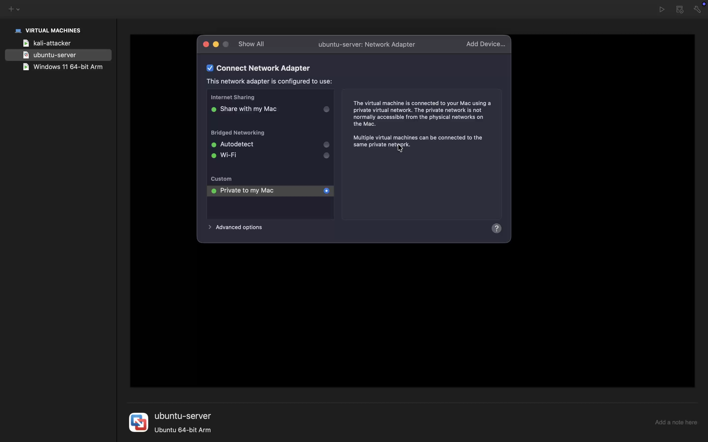

#### 🌍 NAT Adapter
- Provides **internet access** to virtual machines
- Used for downloading packages and updates

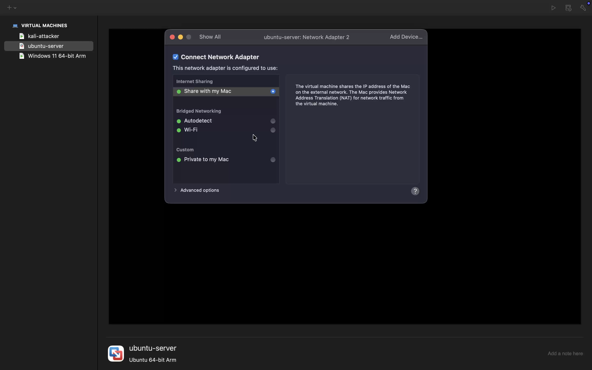

> Combining both adapters created a realistic and flexible lab network — isolated for security testing, yet internet-accessible for package management.

---

## 🔍 Results

| Metric | Outcome |
|--------|---------|
| Hosts Discovered | 3 (Kali, Ubuntu, Windows) |
| Open Ports Identified | ✅ Port 80, 135, 445 |
| Web Service Detected | ✅ Apache HTTP Server |
| Inter-VM Communication | ✅ Verified via ping |
| Web Fingerprinting | ✅ WhatWeb successfully identified stack |

---

## 🧠 Key Learnings

- ✅ Configured a fully functional virtual cybersecurity lab
- ✅ Understood the difference between **Host-only** and **NAT** networking
- ✅ Assigned and managed static IP addresses across VMs
- ✅ Performed network scanning and host discovery with **Nmap**
- ✅ Conducted service version enumeration with `nmap -sV`
- ✅ Installed and configured an **Apache** web server as a realistic target
- ✅ Used **WhatWeb** for passive web technology fingerprinting
- ✅ Gained insight into attacker **reconnaissance techniques**

---

## 🚀 Conclusion

This lab provided practical, hands-on experience in building an isolated cybersecurity environment and performing foundational reconnaissance tasks. The skills practiced here — network configuration, host discovery, service enumeration, and web fingerprinting — are directly applicable to both **penetration testing** and **security monitoring** roles.

---

## ⚠️ Disclaimer

> This lab was conducted in a **controlled virtual environment** for **educational purposes only**.  
> All scanning and testing was performed exclusively on machines owned and operated within the lab.  
> Do not replicate these techniques on networks or systems you do not own or have explicit permission to test.

---

<div align="center">

**Built for learning. Designed for defenders.**  

</div>
