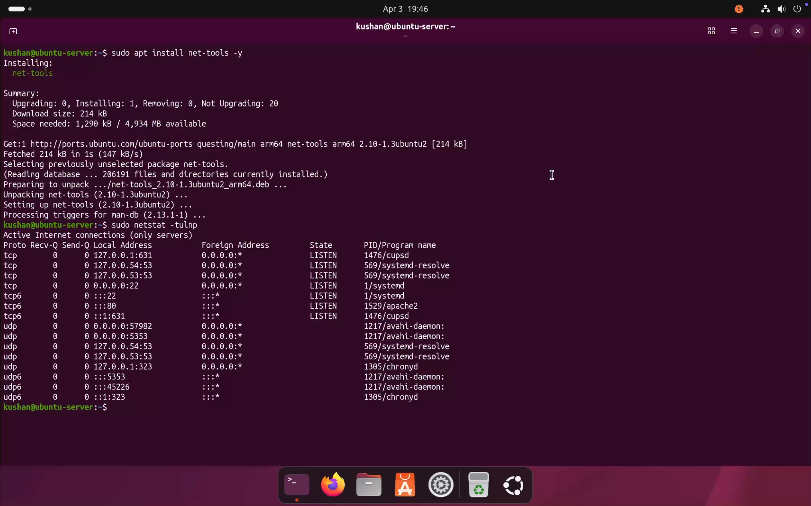
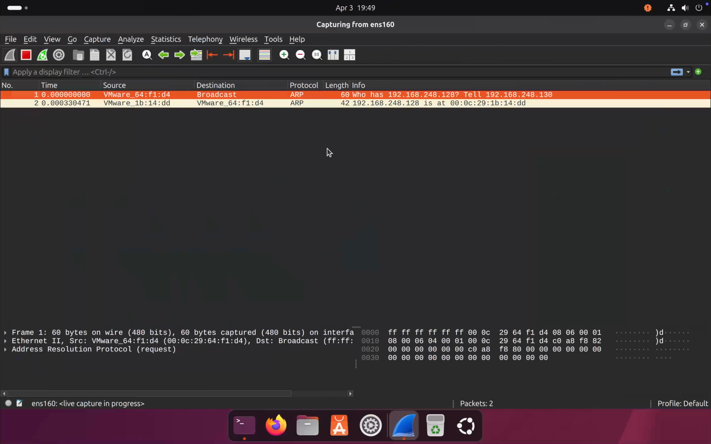
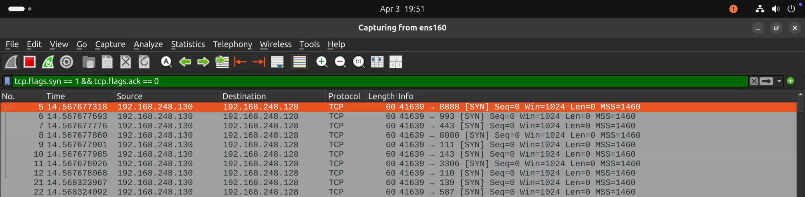
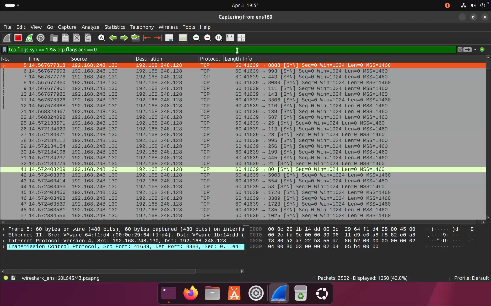

# 🔍 Lab 5: Detecting Port Scanning using Nmap and Wireshark

> *Simulate a port scanning attack from Kali Linux using Nmap, then detect and analyze the scanning patterns using Wireshark and tcpdump on the target Ubuntu Server.*

---

## 📋 Table of Contents

- [Objective](#-objective)
- [Lab Environment](#-lab-environment)
- [Tools Used](#️-tools-used)
- [Scenario Overview](#-scenario-overview)
- [Lab Steps](#️-lab-steps)
  - [1. Install net-tools](#1️⃣-install-net-tools)
  - [2. Check Open Ports](#2️⃣-check-open-ports)
  - [3. Start Wireshark](#3️⃣-start-wireshark)
  - [4. Launch Nmap Scan](#4️⃣-launch-nmap-scan-attacker)
  - [5. Detect Scan in Wireshark](#5️⃣-detect-scan-in-wireshark)
  - [6. Identify Attacker](#6️⃣-identify-attacker)
  - [7. Packet-Level Monitoring with tcpdump](#7️⃣-packet-level-monitoring-tcpdump)
- [Detection Indicators](#-detection-indicators)
- [Attack Flow](#-attack-flow)
- [Skills Demonstrated](#-skills-demonstrated)
- [Key Learnings](#-key-learnings)
- [Conclusion](#-conclusion)

---

## 🎯 Objective

Detect port scanning activity initiated from an attacker machine using **Nmap**. Analyze captured network traffic with **Wireshark** and **tcpdump** to identify scanning patterns, flag suspicious behavior, and attribute the attack to the source IP.

---

## 🧱 Lab Environment

| Setting | Details |
|---------|---------|
| Hypervisor | VMware Fusion |

### 🖥️ Machines

| Role | OS | IP Address |
|------|----|-----------|
| 🔴 Attacker | Kali Linux | `192.168.248.130` |
| 🟢 Target | Ubuntu Server | `192.168.248.128` |

---

## 🛠️ Tools Used

| Tool | Purpose |
|------|---------|
| **Nmap** (`-A`) | Port scanning and service/OS detection |
| **Wireshark** | Capture and visualize network traffic |
| **tcpdump** | Packet-level CLI monitoring |
| **net-tools** | Check open ports with `netstat` |

---

## 🚨 Scenario Overview

```
[Kali Linux] ──── nmap -A 192.168.248.128 ────▶ [Ubuntu Server]
                                                        │
                                              SYN packets flood
                                              multiple ports probed
                                                        │
                                                   Wireshark
                                             (filter: SYN packets)
                                                        │
                                           Source IP identified ✅
                                           Scanning pattern confirmed ✅
```

- **Nmap** (`-A`) launched from Kali to perform an aggressive scan against Ubuntu
- **Wireshark** captures all traffic on interface `ens160`
- SYN packet filter applied to isolate scanning activity
- **tcpdump** used as an additional CLI-based monitoring layer

---

## ⚙️ Lab Steps

---

### 1️⃣ Install net-tools

`net-tools` was installed on Ubuntu to enable the `netstat` command for checking open ports.

```bash
sudo apt update
sudo apt install net-tools -y
```

---

### 2️⃣ Check Open Ports

Active listening ports were enumerated on the Ubuntu Server before the scan to understand the attack surface.

```bash
sudo netstat -tulnp
```



#### 🔍 Observations

| Port | Service | Status |
|------|---------|--------|
| `22` | SSH (OpenSSH) | 🟢 Open |
| `80` | HTTP (Apache) | 🟢 Open |
| Other | System services | 🟢 Running |

> ⚠️ These open ports represent the visible attack surface — exactly what an attacker would discover during reconnaissance.

---

### 3️⃣ Start Wireshark

Wireshark was launched on Ubuntu and set to capture traffic on the lab network interface.

```bash
sudo wireshark
```

- **Interface selected:** `ens160`
- Capture started before the attack was launched



---

### 4️⃣ Launch Nmap Scan (Attacker)

From the Kali Linux attacker machine, an aggressive Nmap scan was launched against the Ubuntu target.

```bash
nmap -A 192.168.248.128
```

| Flag | Function |
|------|---------|
| `-A` | Enables OS detection, version detection, script scanning, and traceroute |


#### 🔍 Observations
- Multiple ports scanned in rapid succession
- Service names and versions detected
- OS fingerprinting performed

---

### 5️⃣ Detect Scan in Wireshark

A display filter was applied in Wireshark to isolate SYN packets — the primary indicator of a port scan.

```
tcp.flags.syn == 1 && tcp.flags.ack == 0
```

> 💡 This filter shows only **initial SYN packets** — connection attempts with no prior handshake — which are the hallmark of port scanning.



#### 🔍 Observations
- Large volume of SYN packets in a very short time window
- Many different destination ports targeted from the same source
- Rapid sequential connection attempts — consistent with automated scanning

---

### 6️⃣ Identify Attacker

From the filtered packet data, the attacker was clearly identified:

| Field | Value |
|-------|-------|
| Source IP | `192.168.248.130` 🔴 (Kali — Attacker) |
| Destination IP | `192.168.248.128` 🟢 (Ubuntu — Target) |
| Behavior | One source → many ports, high speed |



> 🧠 **Key Insight:** A single IP sending SYN packets to many ports in rapid succession is the clearest signature of port scanning. No legitimate user behavior matches this pattern.

---

### 7️⃣ Packet-Level Monitoring: tcpdump

As a complementary tool, `tcpdump` was used to monitor raw packet-level traffic directly from the terminal.

```bash
sudo tcpdump -i ens160
```


#### 🔍 Observations
- Continuous stream of packets visible during the scan
- TCP flags (`SYN`, `ACK`, `FIN`, `RST`) visible in output
- Multiple service interactions captured alongside scan traffic

---

## 🔍 Detection Indicators

The following behaviors, observed in Wireshark and tcpdump, are characteristic of port scanning:

| Indicator | Description |
|-----------|-------------|
| 🚩 High SYN volume | Large number of SYN-only packets in a short window |
| 🚩 Single source IP | Same attacker IP targeting many destination ports |
| 🚩 Rapid attempts | Sequential port probes within milliseconds |
| 🚩 No full handshakes | SYN sent, no SYN-ACK follow-through on closed ports |
| 🚩 Service probing | Version and OS detection traffic alongside basic scan |

---

## 🧪 Attack Flow

```
 1. Install net-tools on Ubuntu
 2. Enumerate open ports with netstat (attack surface)
 3. Start Wireshark capture on ens160
 4. Launch nmap -A from Kali → Ubuntu ──── Attack begins
 5. Apply filter: tcp.flags.syn == 1 && tcp.flags.ack == 0
 6. Observe burst of SYN packets across many ports
 7. Identify source IP: 192.168.248.130 (Kali) ✅
 8. Monitor raw traffic with tcpdump for deeper visibility ✅
```

---

## 🧠 Skills Demonstrated

- ✅ Enumerating open ports and understanding attack surface
- ✅ Capturing live network traffic with Wireshark
- ✅ Applying targeted display filters to isolate malicious traffic
- ✅ Recognizing port scanning patterns at the packet level
- ✅ Identifying and attributing attacks to a source IP
- ✅ Using `tcpdump` for CLI-based packet monitoring
- ✅ Correlating attacker behavior across multiple tools

---

## 📘 Key Learnings

- ✅ Port scanning is a core **reconnaissance technique** — detecting it early is critical
- ✅ **SYN packets** without completing the handshake are the primary scan signature
- ✅ Wireshark's display filters are essential for cutting through traffic noise
- ✅ The same source IP hitting many ports rapidly is always suspicious
- ✅ `tcpdump` provides lightweight packet visibility without a GUI
- ✅ Understanding what "normal" traffic looks like makes anomalies easier to spot

---

## 🚀 Conclusion

This lab demonstrated how to detect and analyze port scanning activity using Wireshark and tcpdump. By filtering for SYN-only packets and correlating traffic patterns, the attacker's IP and scanning behavior were clearly identified — reinforcing the importance of network traffic analysis as a core defensive skill in cybersecurity monitoring and incident response.

---

## ⚠️ Disclaimer

> This lab was conducted in a **controlled virtual environment** for **educational purposes only**.  
> Do not replicate these techniques on any network or system without explicit written authorization.

---

<div align="center">

*🔍 Lab 5 — Port Scan Detection with Nmap & Wireshark · Cybersecurity Home Lab Series*

</div>
