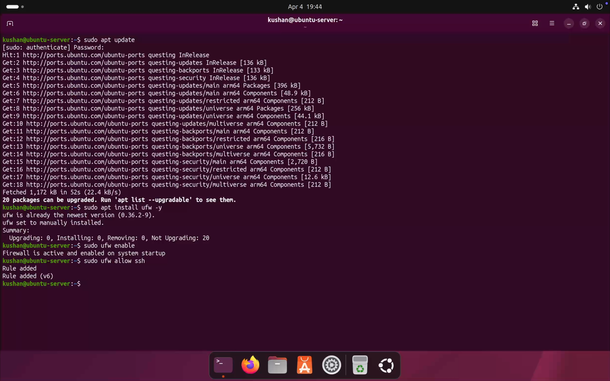
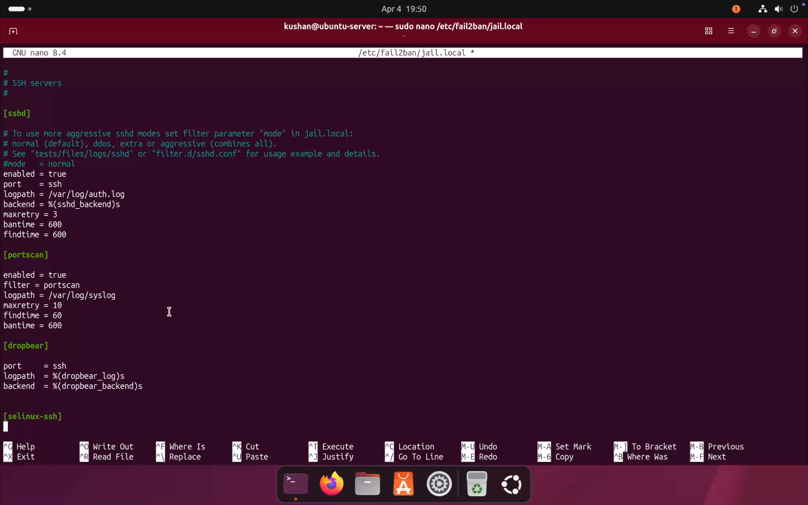
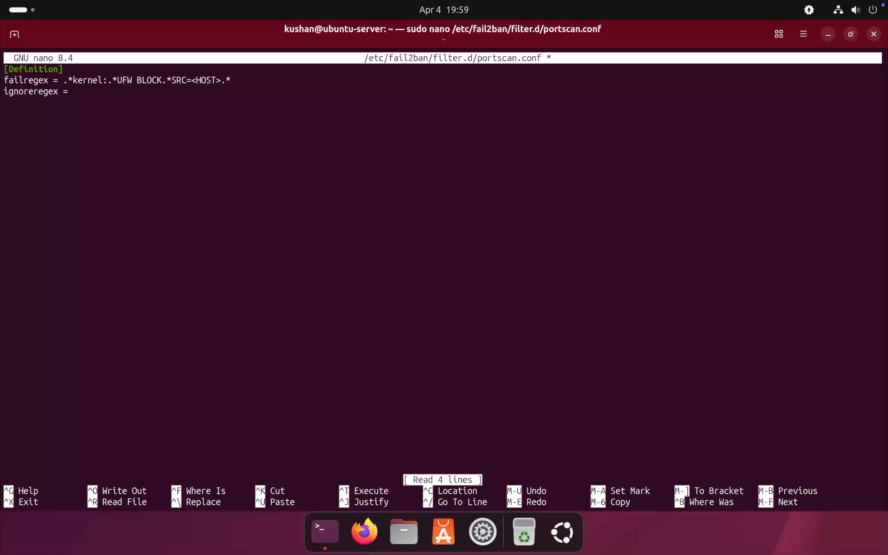
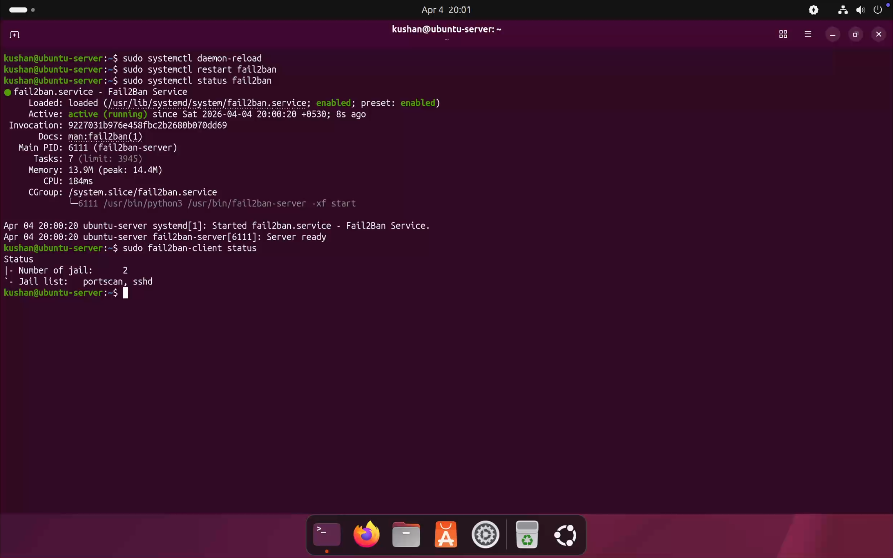
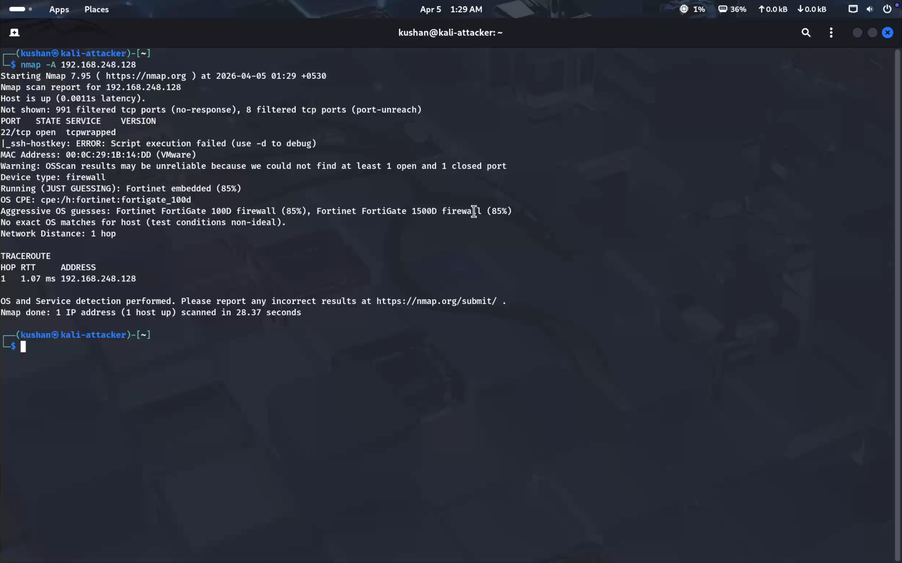
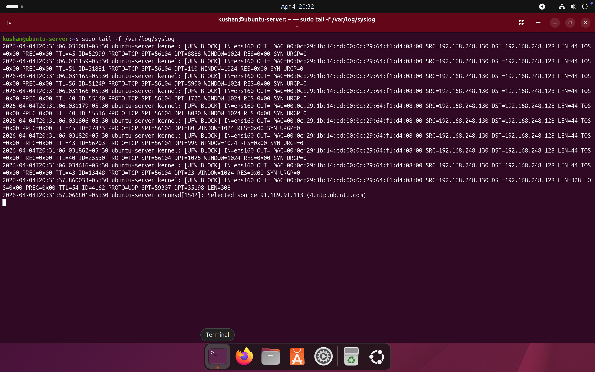
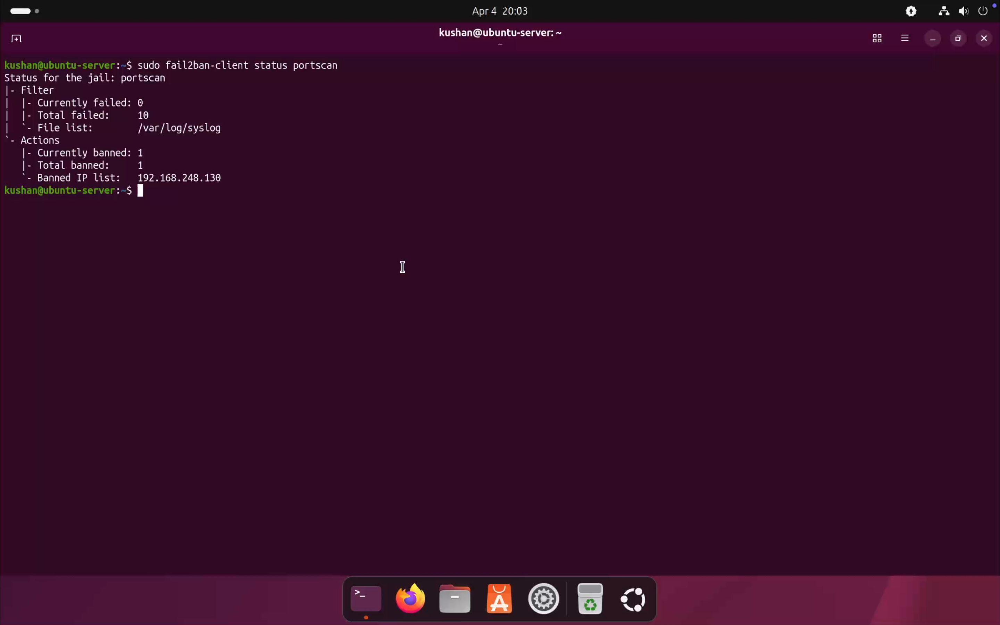
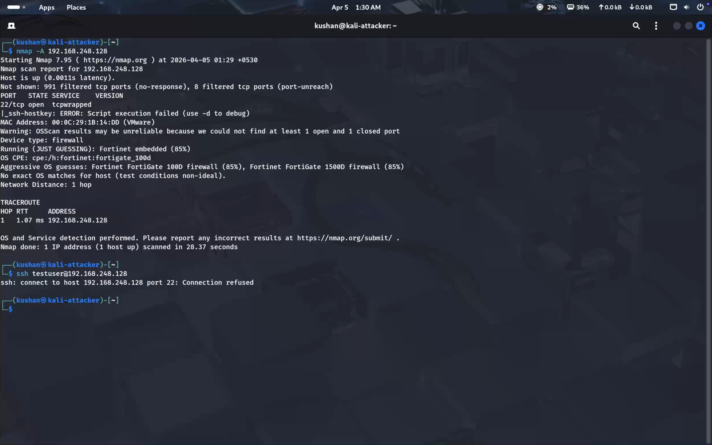

# 🛡️ Lab 6: Detect and Block Port Scanning using UFW + Fail2Ban

> *Combine UFW firewall logging with Fail2Ban's automated response engine to detect port scanning traffic and instantly ban the attacker's IP — without any manual intervention.*

---

## 📋 Table of Contents

- [Objective](#-objective)
- [Lab Environment](#-lab-environment)
- [Tools Used](#️-tools-used)
- [Scenario Overview](#-scenario-overview)
- [Lab Steps](#️-lab-steps)
  - [1. Enable UFW Firewall](#1️⃣-enable-ufw-firewall)
  - [2. Configure Fail2Ban Jail](#2️⃣-configure-fail2ban-jail)
  - [3. Create Port Scan Filter](#3️⃣-create-port-scan-filter)
  - [4. Restart Fail2Ban](#4️⃣-restart-fail2ban)
  - [5. Verify Fail2Ban Status](#5️⃣-verify-fail2ban-status)
  - [6. Launch Port Scan from Attacker](#6️⃣-launch-port-scan-attacker)
  - [7. Check UFW Logs](#7️⃣-check-ufw-logs-detection)
  - [8. Verify Attacker Blocked](#8️⃣-verify-attacker-blocked)
  - [9. Test Block from Attacker](#9️⃣-test-block-from-attacker)
- [Detection & Response Flow](#-detection--response-flow)
- [Skills Demonstrated](#-skills-demonstrated)
- [Key Learnings](#-key-learnings)
- [Conclusion](#-conclusion)

---

## 🎯 Objective

Detect port scanning activity launched from Kali Linux using **Nmap**, and automatically block the attacker by combining **UFW** (firewall logging) with **Fail2Ban** (automated IP banning) — demonstrating a full detect-and-respond pipeline with zero manual intervention.

---

## 🧱 Lab Environment

| Setting | Details |
|---------|---------|
| Hypervisor | VMware Fusion |

### 🖥️ Machines

| Role | OS | IP Address |
|------|----|-----------|
| 🔴 Attacker | Kali Linux | `192.168.248.130` |
| 🟢 Defender | Ubuntu Server | `192.168.248.128` |

---

## 🛠️ Tools Used

| Tool | Role |
|------|------|
| **UFW** | Firewall — blocks traffic and logs suspicious packets |
| **Fail2Ban** | Reads UFW logs and auto-bans attacker IPs |
| **Nmap** (`-A`) | Simulates the port scanning attack from Kali |

---

## 🚨 Scenario Overview

```
[Kali Linux]
     │
     │  nmap -A 192.168.248.128
     ▼
[Ubuntu Server]
     │
     ├── UFW detects & logs suspicious SYN packets
     │        /var/log/syslog
     │              │
     │         Fail2Ban reads logs
     │         Matches portscan filter
     │              │
     │      Attacker IP auto-banned ✅
     │
     └── SSH from Kali → Connection refused ✅
```

- **Nmap** (`-A`) launched from Kali — aggressive scan across all ports
- **UFW** logs blocked packets to `/var/log/syslog`
- **Fail2Ban** reads syslog, matches the custom `portscan` filter, and bans the source IP
- Attack is blocked **automatically** — no manual intervention required

---

## ⚙️ Lab Steps

---

### 1️⃣ Enable UFW Firewall

UFW was enabled on the Ubuntu Server and SSH access was explicitly allowed to avoid locking out the defender.

```bash
sudo ufw enable
```

```bash
sudo ufw allow ssh
```

> ⚠️ Always allow SSH **before** enabling UFW to prevent losing remote access to the server.



---

### 2️⃣ Configure Fail2Ban Jail

A custom jail was added to `jail.local` to monitor syslog for port scanning activity.

```bash
sudo nano /etc/fail2ban/jail.local
```

Add the following section:

```ini
[portscan]
enabled  = true
filter   = portscan
logpath  = /var/log/syslog
maxretry = 10
findtime = 60
bantime  = 600
```

| Parameter | Value | Meaning |
|-----------|-------|---------|
| `filter` | `portscan` | Points to custom filter file |
| `logpath` | `/var/log/syslog` | Where UFW writes blocked packet logs |
| `maxretry` | `10` | Trigger ban after 10 matches |
| `findtime` | `60` | Count matches within a 60-second window |
| `bantime` | `600` | Ban lasts 600 seconds (10 minutes) |



---

### 3️⃣ Create Port Scan Filter

A custom Fail2Ban filter was created to match UFW block log entries.

```bash
sudo nano /etc/fail2ban/filter.d/portscan.conf
```

```ini
[Definition]
failregex = .*kernel:.*UFW BLOCK.*SRC=<HOST>.*
ignoreregex =
```

| Component | Explanation |
|-----------|-------------|
| `UFW BLOCK` | Matches entries where UFW explicitly blocked a packet |
| `SRC=<HOST>` | Extracts the source IP to be banned |
| `ignoreregex` | No exceptions — all matching IPs are flagged |

> 💡 The `<HOST>` placeholder is a Fail2Ban built-in that automatically captures the offending IP address from the log line.



---

### 4️⃣ Restart Fail2Ban

Configuration changes were applied by reloading the service.

```bash
sudo systemctl daemon-reload
sudo systemctl restart fail2ban
```

---

### 5️⃣ Verify Fail2Ban Status

Confirmed Fail2Ban was running and the new `portscan` jail was active.

```bash
sudo fail2ban-client status
```



---

### 6️⃣ Launch Port Scan (Attacker)

From the Kali Linux attacker machine, an aggressive Nmap scan was launched.

```bash
nmap -A 192.168.248.128
```

| Flag | Effect |
|------|--------|
| `-A` | OS detection + version detection + scripts + traceroute |



---

### 7️⃣ Check UFW Logs (Detection)

On the Ubuntu defender, syslog was monitored in real time to observe UFW logging the scan traffic.

```bash
sudo tail -f /var/log/syslog
```



#### 🔍 Observations

| Indicator | Detail |
|-----------|--------|
| Log entry type | `kernel: UFW BLOCK` |
| Source IP logged | `192.168.248.130` (Kali) |
| Connection attempts | Multiple, across many ports |
| Fail2Ban trigger | Pattern matched → ban initiated |

---

### 8️⃣ Verify Attacker Blocked

The `portscan` jail status was checked to confirm the attacker's IP was added to the ban list.

```bash
sudo fail2ban-client status portscan
```

Expected output:
```
Status for the jail: portscan
|- Filter
|  |- Currently failed: X
|  `- Total failed:     X
`- Actions
   |- Currently banned: 1
   `- Banned IP list:   192.168.248.130
```



---

### 9️⃣ Test Block from Attacker

An SSH connection was attempted from Kali to confirm the ban was enforced at the firewall level.

```bash
ssh testuser@192.168.248.128
```

#### ✅ Result
- Connection **refused** or **timed out**
- Attacker IP is fully blocked — no further access possible



---

## 🔍 Detection & Response Flow

```
 1. Nmap -A scan launched from Kali (192.168.248.130)
        │
 2. UFW detects blocked SYN packets across many ports
        │
        ▼
    /var/log/syslog
    kernel: UFW BLOCK SRC=192.168.248.130 ...
        │
 3. Fail2Ban reads syslog continuously
        │
 4. Custom filter matches: .*UFW BLOCK.*SRC=<HOST>.*
        │
 5. 10+ matches within 60 seconds → threshold reached
        │
 6. Fail2Ban auto-bans 192.168.248.130 via iptables ✅
        │
 7. SSH from Kali → Connection refused ✅
```

---

## 🧠 Skills Demonstrated

- ✅ Configuring and enabling UFW as a defensive firewall
- ✅ Writing custom Fail2Ban jails and filters
- ✅ Understanding `failregex` pattern matching against log entries
- ✅ Connecting UFW log output to Fail2Ban's detection engine
- ✅ Simulating a port scan and verifying automated detection
- ✅ Confirming IP bans via `fail2ban-client status`
- ✅ Validating firewall blocks from the attacker's perspective

---

## 📘 Key Learnings

- ✅ **UFW alone logs threats** — but Fail2Ban turns those logs into automated action
- ✅ Custom filters give Fail2Ban the ability to detect **any** attack pattern that appears in logs
- ✅ The `<HOST>` placeholder in `failregex` is what links a log entry to an IP ban
- ✅ Port scanning generates a distinctive burst of `UFW BLOCK` entries — easy to detect
- ✅ Combining detection + automated response is a core principle of real-world defense systems
- ✅ Always allow SSH before enabling UFW to avoid locking yourself out

---

## 🚀 Conclusion

This lab demonstrated a complete **detect-and-respond pipeline** against port scanning attacks. By configuring UFW to log blocked traffic and Fail2Ban to automatically parse those logs and ban offending IPs, the Ubuntu server was able to identify and neutralize the attacker without any manual intervention, reflecting a key principle of modern automated security operations.

---

## ⚠️ Disclaimer

> This lab was conducted in a **controlled virtual environment** for **educational purposes only**.  
> Do not replicate these techniques on any network or system without explicit written authorization.

---

<div align="center">

*🛡️ Lab 6 — Port Scan Detection & Blocking with UFW + Fail2Ban · Cybersecurity Home Lab Series*

</div>
